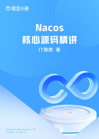

# Nacos 核心源码精讲

> 简介：全方位源码精讲，深度剖析 Nacos 注册中心和配置中心的核心思想

> 讲师：IT贱男

> 价格：¥49.9

> [官方链接：https://juejin.cn/book/7180604185786712075?utm_source=course_list](https://juejin.cn/book/7180604185786712075?utm_source=course_list)

> [阿里网盘：]()

> [百度网盘：]()

> [夸克网盘：]()
