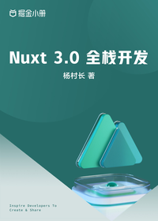

# Nuxt 3.0 全栈开发

> 简介：核心知识 + 工程架构 + 全栈进阶 + 项目实战，快速精通 Nuxt3 开发！

> 讲师：杨村长

> 价格：¥129

> [官方链接：https://juejin.cn/book/7202149403342143520?utm_source=course_list](https://juejin.cn/book/7202149403342143520?utm_source=course_list)

> [阿里网盘：]()

> [百度网盘：]()

> [夸克网盘：]()
