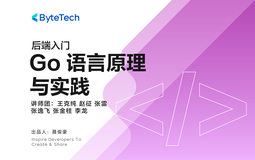

# 后端入门 - Go 语言原理与实践

> 简介：走进字节企业级后端研发，全方位掌握Go语言的最佳实践

> 讲师：ByteTech

> 内容：13个视频·7小时52分钟

> [官方链接：https://juejin.cn/course/bytetech/7140987981803814919?from_page=course_list_page](https://juejin.cn/course/bytetech/7140987981803814919?from_page=course_list_page)

> [阿里网盘：]()

> [百度网盘：]()

> [夸克网盘：]()
