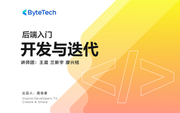

# 后端入门 - 开发与迭代

> 简介：还原企业真实系统开发场景，体验高效率开发与迭代

> 讲师：ByteTech

> 内容：10个视频·4小时42分钟

> [官方链接：https://juejin.cn/course/bytetech/7142773151435489288?from_page=course_list_page](https://juejin.cn/course/bytetech/7142773151435489288?from_page=course_list_page)

> [阿里网盘：]()

> [百度网盘：]()

> [夸克网盘：]()
