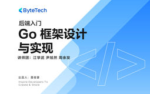

# 后端入门 - Go 框架设计与实现

> 简介：走进企业级后端研发，攻克Go语言框架几大核心概念

> 讲师：ByteTech

> 内容：8个视频·4小时5分钟

> [官方链接：https://juejin.cn/course/bytetech/7142811324462923783?from_page=course_list_page](https://juejin.cn/course/bytetech/7142811324462923783?from_page=course_list_page)

> [阿里网盘：]()

> [百度网盘：]()

> [夸克网盘：]()
