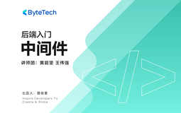

# 后端入门 - 中间件

> 简介：接轨企业真实应用场景，带你领略一条“消息”的生命历程

> 讲师：ByteTech

> 内容：7个视频·3小时21分钟

> [官方链接：https://juejin.cn/course/bytetech/7142834860837568520?from_page=course_list_page](https://juejin.cn/course/bytetech/7142834860837568520?from_page=course_list_page)

> [阿里网盘：]()

> [百度网盘：]()

> [夸克网盘：]()
