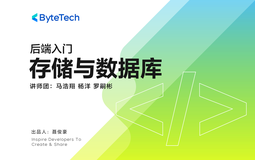

# 后端入门 - 存储与数据库

> 简介：逐层构建存储与数据库知识体系，体验字节内部实践案例

> 讲师：ByteTech

> 内容：11个视频·6小时16分钟

> [官方链接：https://juejin.cn/course/bytetech/7142838251227709448?from_page=course_list_page](https://juejin.cn/course/bytetech/7142838251227709448?from_page=course_list_page)

> [阿里网盘：]()

> [百度网盘：]()

> [夸克网盘：]()
