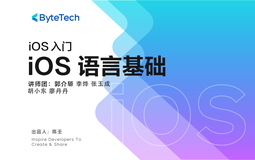

# iOS 入门 - iOS 语言基础

> 简介：iOS开发语言学习锦囊全收，轻松应对开发难题

> 讲师：ByteTech

> 内容：18个视频·5小时38分钟

> [官方链接：https://juejin.cn/course/bytetech/7158705477671452680?from_page=course_list_page](https://juejin.cn/course/bytetech/7158705477671452680?from_page=course_list_page)

> [阿里网盘：]()

> [百度网盘：]()

> [夸克网盘：]()
