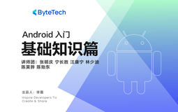

# Android 入门 - 基础知识篇

> 简介：聚焦Android基本原理，循序渐进理清系统底层问题

> 讲师：ByteTech

> 内容：18个视频·8小时13分钟

> [官方链接：https://juejin.cn/course/bytetech/7158718464956792845?from_page=course_list_page](https://juejin.cn/course/bytetech/7158718464956792845?from_page=course_list_page)

> [阿里网盘：]()

> [百度网盘：]()

> [夸克网盘：]()
