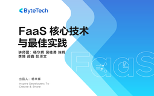

# FaaS 核心技术与最佳实践

> 简介：走进大厂的FaaS落地实践，快速掌握技术新潮流

> 讲师：ByteTech

> 内容：6个视频·3小时58分钟

> [官方链接：https://juejin.cn/course/bytetech/7169476493125353485?from_page=course_list_page](https://juejin.cn/course/bytetech/7169476493125353485?from_page=course_list_page)

> [阿里网盘：]()

> [百度网盘：]()

> [夸克网盘：]()
