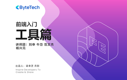

# 前端入门 - 工具篇

> 简介：掌握前端开发必备技能，深化工程化思维

> 讲师：ByteTech

> 内容：13个视频·6小时7分钟

> [官方链接：https://juejin.cn/course/bytetech/7180922988034785336?from_page=course_list_page](https://juejin.cn/course/bytetech/7180922988034785336?from_page=course_list_page)

> [阿里网盘：]()

> [百度网盘：]()

> [夸克网盘：]()
