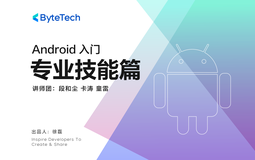

# Android 入门 - Android 专业技能篇

> 简介：由表及里，学习Top级团队对App性能问题的体系化经验与方案

> 讲师：ByteTech

> 内容：7个视频·3小时26分钟

> [官方链接：https://juejin.cn/course/bytetech/7181341416323285047?from_page=course_list_page](https://juejin.cn/course/bytetech/7181341416323285047?from_page=course_list_page)

> [阿里网盘：]()

> [百度网盘：]()

> [夸克网盘：]()
