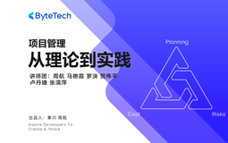

# 项目管理 - 从理论到实践

> 简介：连接大厂项目，全方位解读项目管理基础理念和实战初阶技巧

> 讲师：ByteTech

> 内容：8个视频·3小时3分钟

> [官方链接：https://juejin.cn/course/bytetech/7181363006335352890?from_page=course_list_page](https://juejin.cn/course/bytetech/7181363006335352890?from_page=course_list_page)

> [阿里网盘：]()

> [百度网盘：]()

> [夸克网盘：]()
