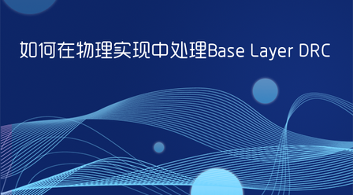

# 在物理实现中处理Base Layer DRC

> 价格：免费

> [官方链接：https://study.163.com/course/introduction/1006305009.htm](https://study.163.com/course/introduction/1006305009.htm)

> [阿里网盘：]()

> [百度网盘：]()

> [夸克网盘：]()
