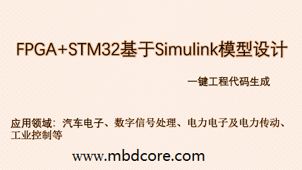

# FPGA+STM32 MATLAB基于模型设计

> 价格：免费

> [官方链接：https://study.163.com/course/introduction/1209337806.htm](https://study.163.com/course/introduction/1209337806.htm)

> [阿里网盘：]()

> [百度网盘：]()

> [夸克网盘：]()
